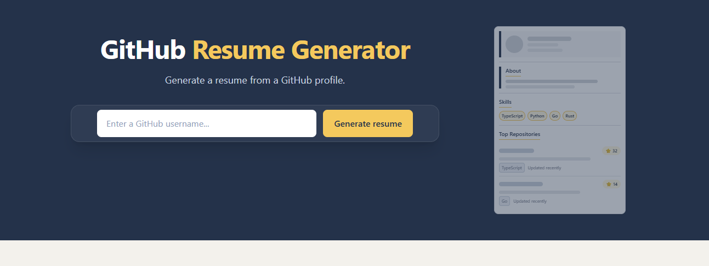

# GitHub Resume Generator

GitHub profile to resume-style page generator built with Next.js.

## Live Demo

[View the application](https://m-a-github-resume-generator.vercel.app/)



---

## About the Project

### Objective

Build an application that generates a resume-style layout from a public GitHub profile.

The project focuses on:

- API data fetching
- Data selection logic
- Error handling
- Responsive design
- Print-friendly layout
- Unit and component testing

---

## Project Overview

The application includes the following features:

- **Profile Fetching**  
  Retrieve public profile data from the GitHub API.

- **Repository Selection**  
  Fetch public repositories and automatically select up to 6 projects.  
  The primary selection keeps non-fork repositories with a description and at least one star, sorted by star count.  
  If no repository matches these conditions, the application falls back to non-fork repositories with a description, sorted by last update.

- **Skills Computation**  
  Compute up to 5 top languages based on the repositories displayed in the resume.

- **Username Validation**  
  Validate GitHub usernames before sending the request.

- **Error Handling**  
  Handle user not found, repository fetch failure and GitHub rate limit.

- **Responsive Layout**  
  Adapt the generator and generated resume to smaller screen sizes.

- **Print to PDF**  
  Generate a print-friendly resume layout using the browser print function.

- **Testing**  
  Unit and component tests with Jest and React Testing Library.

---

## Built With


---

## Features

- Fetch GitHub profile data
- Fetch and filter repositories
- Automatic repository selection with fallback logic
- Display up to 6 repositories
- Compute up to 5 top languages
- Validate GitHub usernames
- Loading state handling
- Error handling (404, rate limit, fetch errors)
- Responsive resume layout
- Print to PDF functionality
- Unit and component tests

---


---

## Installation

```bash
git clone https://github.com/m-amroune/github-resume-generator.git
cd github-resume-generator
npm install
npm run dev
```
